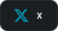

<picture>
  <source media="(prefers-color-scheme: dark)"  srcset="assets/card-dark.svg">
  <source media="(prefers-color-scheme: light)" srcset="assets/card-light.svg">
  
</picture>

<!-- The card is one image, and an image served through GitHub's proxy cannot
     carry links, so the row lives out here: one small image per link, each in
     the card's own materials, each wrapped in an <a> that also carries the
     hover title. tools/build.py draws them. The portfolio joins this row as
     soon as it is hosted somewhere. -->

  <a href="https://www.linkedin.com/in/mohammad-ali-al-tamimi" title="Mohammad Ali Al-Tamimi on LinkedIn"><picture><source media="(prefers-color-scheme: light)" srcset="assets/link-linkedin-light.svg"></picture></a>
  <a href="mailto:ali.tamimi911@gmail.com" title="ali.tamimi911@gmail.com"><picture><source media="(prefers-color-scheme: light)" srcset="assets/link-email-light.svg"></picture></a>
  <a href="https://x.com/alitamimio" title="@alitamimio on X"><picture><source media="(prefers-color-scheme: light)" srcset="assets/link-x-light.svg"></picture></a>
  <a href="tools/build.py" title="tools/build.py, the script that draws this card"><picture><source media="(prefers-color-scheme: light)" srcset="assets/link-build-light.svg"></picture></a>

<picture>
  <source media="(prefers-color-scheme: dark)"  srcset="https://raw.githubusercontent.com/alitamimio/alitamimio/output/snake-dark.svg">
  <source media="(prefers-color-scheme: light)" srcset="https://raw.githubusercontent.com/alitamimio/alitamimio/output/snake-light.svg">
  
</picture>
