<picture>
  <source media="(prefers-color-scheme: dark)"  srcset="assets/hero-dark.svg">
  <source media="(prefers-color-scheme: light)" srcset="assets/hero-light.svg">
  
</picture>

I'm a frontend engineer who owns the whole path — the interface, the service behind it, and the database under that. Most of my work is bilingual (English and Arabic, full RTL) and most of it ships to people who are not developers.

---

### What I'm building

**Khayarak** — a price-comparison engine for the Jordanian market. Next.js 16, Tailwind v4, TypeScript, streaming LLM answers over a Python gateway. Every colour pair is contrast-checked in CI, every layout has an RTL twin, and the whole design language lives in a written constitution the build gate enforces.

**VOC360** — a fourteen-service platform for public-sector feedback: intake, classification, root-cause, simulation, BI. FastAPI services, PostgreSQL with pgvector, Redis, all of it in Docker.

**Rased** — real-time traffic intelligence. Live dashboards over a streaming corpus, computer-vision supervision, Prometheus for the metrics layer.

**FortiLink** — a Fortinet integration plugin in TypeScript.

---

### How I work

I keep a design constitution and let the build fail on it. Contrast pairs, token drift, RTL parity and layout rules are all gates rather than opinions, so the review conversation is about the product instead of the spacing.

I test in a real browser. Screenshots at 1440 and 390, both themes, both directions, measured from computed styles rather than eyeballed.

I write down why. Every decision that cost an argument is a dated entry, so the next person — usually me — doesn't relitigate it.

---

### The stack

|  |  |
|---|---|
| **Front** | Next.js · React · TypeScript · Tailwind · SVG/CSS motion · a11y & RTL |
| **Back** | Python · FastAPI · Node · PostgreSQL · Redis · pgvector |
| **Infra** | Docker · Compose · Prometheus · Tailscale · GitHub Actions |
| **AI** | LLM gateways · streaming (SSE) · RAG · Ollama |

---

Amman, Jordan · most of my work lives in private and organisation repos
